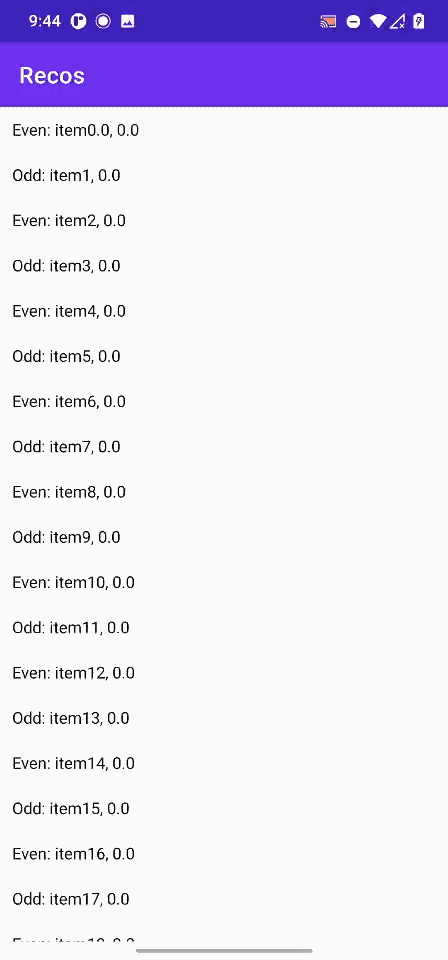

# Recos - experimental ts/jsx to Android Compose/SwiftUI compiler

This repository contains an early prototype of Recos, an experimental compiler, which would compile tx/jsx into Android Jetpack Compose and iOS SwiftUI.

For a long time, many technologies have been introduced to build cross-platform mobile apps using single codebase, and React-Native is the most popular framework in this area. However, React-Native has some kind of performance issues and relatively higher memory usage.

The main goal of Recos is to help us building high performance cross-platform mobile apps in a declarative manner.
## Recos overview


## Getting started with Recos

Before starting this 101 tutorial, make sure our system have installed [node](https://nodejs.org/en/), and suppose we are using macOS, we may consider install it via [brew](https://formulae.brew.sh/formula/node):

```
brew install node
npm install getopts --save
```

For the Android side, in order to make Jetpack Compose works, we must use [Android Studio Preview version](https://developer.android.com/studio/preview) in this moment.

Setting up the development environment is out of the scope of this tutorial, for more information, please read the latest official docs from [Facebook](https://reactnative.dev/docs/environment-setup) and [Google](https://developer.android.com/studio/preview/install-preview).

Using your convenient tool to write the first React app, we will use [TypeScript](https://reactnative.dev/docs/typescript) in this case and named it `hello.tsx`:

```typescript
function Item1(item, onItemClick) {
    const onClick = useCallback(() => {
        onItemClick(item)
    })

    return <Text style={{ color: '#fff' }} onClick={onClick}>偶数：{item.name}, {item.count}</Text>

}

function Item2(item, onItemClick) {
    const onClick = useCallback(() => {
        onItemClick(item)
    })

    return <Text style={{ color: '#fff' }} onClick={onClick}>奇数：{item.name}, {item.count}</Text>
}

function HelloWorld(current) {

    const [data, setData] = useState([])

    useEffect(() => {
        let ret = []
        for (let i = 0; i < 1000; i++) {
            ret.push({
                name: 'item' + i,
                index: i,
                count: 0
            })
        }
        setData(ret)
    }, [current])

    let render = function (i) {
        let item = data[i]
        if (item.index % 2 == 0) {
            return Item1(item, (it) => {
                it.count = it.count + 1
                setData(data)
            })
        } else {
            return Item2(item, (it) => {
                it.count = it.count + 2
                setData(data)
            })
        }
    }

    return <RecyclerView count={data.length} render={render}>Hello World!</RecyclerView>
}
```

The next step would be use `js/cli.js` to compile it into a bundle file:

```shell
node cli.js -s hello.tsx -o hello.bundle
```

Put the output file `hello.bundle` into Android project's `app/src/main/assets`, compile the Android app and we will see:



The example for iOS:


